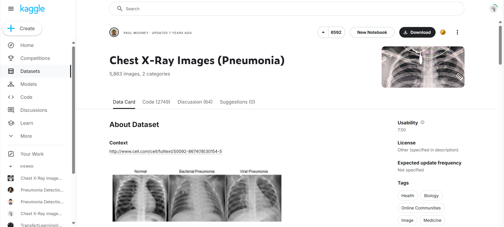
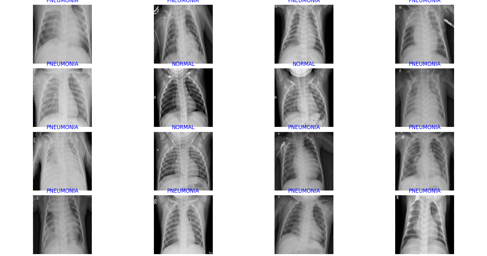

# Pneumonia Detection Model

이 프로젝트는 흉부 X-ray 영상을 분석하여 폐렴 여부를 예측하는 모델을 학습하기 위해 **DenseNet121**, **ResNet50**, 그리고 **EfficientNet-B4**를 사용합니다. 네 가지 접근 방식을 통해 모델 성능을 비교하고, 더 나은 성능을 제공하는 방법을 찾습니다.

## 같이 프로젝트 한사람
- 전북대학교 통계학과 강건우 [전북대학교 통계학과 강건우 깃허브](https://github.com/gumwoo)


## 주요 내용 소개

이 코드에서는 사전 학습된 **ResNet50**, **DenseNet121**, **EfficientNet-B4**를 사용하여 흉부 X-ray 이미지를 분석합니다. **Focal Loss**와 **AdamW 옵티마이저**, 그리고 **Cosine Annealing** 또는 **ReduceLROnPlateau** 학습률 스케줄러를 사용하여 모델을 학습합니다. 각 부분에 대한 세부 설명은 아래와 같습니다.

- **모델 아키텍처**: 사전 학습된 ResNet50, DenseNet121, EfficientNet-B4을 사용하며, 최종 레이어를 이진 분류를 위해 수정했습니다. 추가적으로 **Dropout** 레이어를 추가하여 과적합을 방지합니다.
- **Focal Loss**: 클래스 불균형 문제를 해결하기 위해 Focal Loss를 사용합니다. `alpha`와 `gamma` 값을 조정하여 양성 샘플에 대한 가중치를 부여하고, 어려운 샘플에 대해 더 많은 가중치를 할당합니다.
- **정확도, 정밀도, 재현율, F1 스코어**: 테스트 셋에 대해 정확도, 정밀도, 재현율, F1 스코어를 계산하여 모델 성능을 평가합니다.
- **학습률 스케줄링**: **Cosine Annealing** 또는 **ReduceLROnPlateau** 스케줄러를 사용하여 학습률을 점진적으로 줄여가며 모델의 안정적인 학습을 유도합니다.
- **조기 종료**: 검증 손실이 개선되지 않는 경우 학습을 일찍 종료하도록 설정했습니다. 이는 불필요한 에포크 수를 줄여 과적합을 방지합니다.

## 데이터 전처리 및 증강

데이터셋 다운로드 링크: [Chest X-ray Images (Pneumonia)](https://www.kaggle.com/datasets/paultimothymooney/chest-xray-pneumonia)


모델 학습을 위해 이미지를 224x224 또는 192x192 크기로 조정하고 다양한 증강 기법을 적용했습니다. 이를 통해 모델이 다양한 패턴을 학습하고, 데이터가 부족한 의료 데이터셋에서 과적합을 방지할 수 있도록 합니다.

# 폐렴 진단의 이미지적 접근

의사는 폐렴을 진단하기 위해 주로 흉부 X-ray(흉부 방사선 사진) 또는 CT 스캔을 사용하여 폐 상태를 확인합니다. 이를 통해 폐렴의 징후를 특정 패턴으로 인식할 수 있습니다.

## 1. 정상 폐 이미지
- **색상과 투명도**: 정상적인 폐는 흉부 X-ray에서 어둡고 반투명한 상태로 보입니다. 공기가 가득 차 있기 때문에 X-ray를 잘 통과합니다.
- **폐 구조물의 위치와 선명도**: 정상적인 폐의 림프관, 기관지 등이 뚜렷하게 보이며 폐의 모양이 정상적으로 확장된 상태를 보여줍니다.

## 2. 폐렴의 특징적 이미지 패턴
폐렴이 발생했을 때 나타나는 몇 가지 특징적인 이미지 패턴이 있습니다.

### 2.1. 침윤(Infiltration)
- **침윤**은 염증 반응으로 인해 폐에 액체가 채워지는 현상입니다.
- X-ray 이미지에서는 침윤이 **밝은 흰색 영역**으로 나타납니다. 이는 염증 물질로 인해 X-ray가 통과하지 못해서 발생합니다.

### 2.2. 경화(Consolidation)
- **경화**는 폐의 작은 공기주머니(폐포)가 염증으로 인해 액체로 채워진 상태를 의미합니다.
- 경화된 영역은 **밀집된 흰색**으로 나타나며, 특정 폐엽에 한정되어 있는 경우가 많습니다.

### 2.3. 공기 기관지 음영(Air Bronchogram)
- 폐렴의 경우, 염증이 있는 부위에서도 기관지 안에는 공기가 남아 있어 **공기 기관지 음영**이 나타납니다.
- 이 현상은 흰색 염증 부위 사이에서 어두운 선들이 보이는 형태로 나타나며, 이는 폐포는 염증으로 차 있지만 기관지 내에는 여전히 공기가 존재하기 때문입니다.

### 2.4. 폐의 균일도 변화
- 폐렴에 걸린 부분은 정상적인 폐에 비해 **덜 투명하고 더 밝은 색**으로 보입니다.
- 폐렴이 진행되면서 **비정상적인 패턴**과 폐의 균일도 변화가 나타나게 됩니다.

## 3. 흉막 삼출(Pleural Effusion)
- 폐렴이 심화되면 **흉막 삼출**이 발생할 수 있습니다. 이는 폐와 흉막 사이에 액체가 고이는 현상으로, X-ray에서 **밝은 흰색의 액체층**으로 보이게 됩니다.

## 4. 진단 원리 요약
1. **폐 침윤 및 경화**: 정상적인 폐와 비교했을 때, 흰색의 침윤 영역을 통해 염증 상태를 확인합니다.
2. **공기 기관지 음영**: 염증이 있는 부분과 기관지 내의 공기 사이에 대비되는 어두운 선을 관찰합니다.
3. **흉막 삼출**: 흉막 공간에 고인 액체를 관찰하여 폐렴의 진행 정도를 판단합니다.

의사는 이러한 X-ray 이미지 패턴을 종합적으로 분석하여 폐렴의 여부와 정도를 진단합니다. 최근에는 인공지능(딥러닝 모델)을 활용하여 이러한 이미지를 보다 자동으로 분석하고 진단의 정확성을 높이려는 연구도 활발히 이루어지고 있습니다.
**의사의 이러한 폐렴 판단 원리를 바탕으로 코드를 작성하려고 노력하였습니다.**




### 이미지 전처리 및 증강 설정

- **이미지 크기 조정**: 모든 이미지를 `Resize((224, 224))` 또는 `Resize((192, 192))`로 크기를 조정하여 모델 입력 형식에 맞추었습니다.
- **데이터 증강**: 학습 데이터에 `RandomRotation`, `RandomHorizontalFlip`, `RandomAffine`, `ColorJitter`, `GaussianBlur`, `RandomGrayscale` 등을 적용하여 이미지 회전, 좌우 반전, 이동, 밝기/대비 조정을 수행했습니다.
- **텐서 변환 및 정규화**: 이미지를 텐서 형식으로 변환(`ToTensor()`)하고, 각 채널을 정규화(`Normalize()`)하여 안정적인 학습을 지원했습니다.

## 코드 주요 구성 요소

- **ResNet50 모델 아키텍처**: `torchvision.models.resnet50(weights=models.ResNet50_Weights.DEFAULT)`를 사용하여 사전 학습된 가중치를 활용합니다.
  - 출력층은 `nn.Linear(self.model.fc.in_features, 1)`로 변경하여 이진 분류가 가능하도록 수정되었습니다.
  - **Dropout(0.5)** 레이어를 추가하여 학습 과정에서 과적합을 방지합니다.

- **Focal Loss 정의**
  - `alpha=2`, `gamma=1.5`로 설정하여 클래스 불균형 문제를 해결합니다. `alpha`는 양성 샘플에 대한 가중치이며, `gamma`는 예측이 어려운 샘플에 더 많은 가중치를 할당하는 정도를 조절합니다.

- **Optimizer 및 학습률 스케줄러**
  - 옵티마이저로는 **AdamW**를 사용하며, 학습률은 `lr=0.001`로 설정됩니다. **AdamW**는 가중치 감쇠(weight decay)를 추가로 고려하여 과적합을 방지하는 역할을 합니다.
  - 학습률 스케줄러로 **CosineAnnealingLR**을 사용하여 점진적으로 학습률을 감소시킵니다. 이는 모델이 최적의 손실 함수 최소값을 찾는 데 도움이 됩니다.

  - **EfficientNet 모델 아키텍처**: `EfficientNet.from_pretrained('efficientnet-b4', num_classes=2)`를 사용하여 더 큰 모델을 학습에 적용했습니다.
  - 최종 레이어는 `nn.Linear(1792, 512)`와 같이 추가 레이어를 포함하여 변경하였습니다.

- **Focal Loss 정의**
  - `alpha=2`, `gamma=1.5` 또는 `gamma=2.0`으로 설정하여 클래스 불균형 문제를 해결합니다. `alpha`는 양성 샘플에 대한 가중치이며, `gamma`는 예측이 어려운 샘플에 더 많은 가중치를 할당하는 정도를 조절합니다.

- **Optimizer 및 학습률 스케줄러**
  - 옵티마이저로는 **AdamW**를 사용하며, 학습률은 `lr=0.001` 또는 `lr=0.0001`로 설정됩니다. **AdamW**는 가중치 감쇠(weight decay)를 추가로 고려하여 과적합을 방지하는 역할을 합니다.
  - 학습률 스케줄러로 **CosineAnnealingLR** 또는 **ReduceLROnPlateau**을 사용하여 점진적으로 학습률을 감소시킵니다. 이는 모델이 최적의 손실 함수 최소값을 찾는 데 도움이 됩니다.


## 학습 및 평가

- **학습 과정**
  - **에포크 수**: 기본적으로 10번의 에포크 동안 학습하며, 학습 중 검증 손실이 개선되지 않으면 **조기 종료**를 발동하여 학습을 중단할 수 있습니다.
  - 학습 도중 **조기 종료 조건**을 만족하면 `pneumonia_detection_model_optimized.pth` 파일에 가장 성능이 좋은 모델이 저장됩니다.

- **테스트 평가 (Test-Time Augmentation 포함)**
  - 모델은 테스트 단계에서 **Test-Time Augmentation (TTA)**을 적용하여 다양한 각도로 회전된 이미지를 평가하며, 결과를 평균하여 최종 예측을 내립니다.
  - 예측값의 임계값(threshold)은 **0.8**로 설정하여 폐렴 진단에 대한 모델의 신뢰성을 높였습니다.
  - **정확도(Accuracy)**, **정밀도(Precision)**, **재현율(Recall)**, **F1 스코어**를 통해 모델의 최종 성능을 평가합니다.

## 첫 번째 코드

첫 번째 코드에서는 기본적인 데이터 증강만을 적용하며, 클래스 불균형 문제에 대한 특별한 조정을 하지 않았습니다.

- **데이터 증강**: `RandomRotation`, `RandomHorizontalFlip`, `RandomResizedCrop`을 사용하여 이미지 회전, 좌우 반전, 크기 변형 등의 간단한 증강 기법을 적용했습니다.
- **클래스 불균형 문제 해결 없음**: 손실 함수 `BCEWithLogitsLoss`에는 클래스 가중치나 불균형 보정이 없습니다.
- **데이터 로더**: `train_loader`, `val_loader`는 데이터셋에서 무작위로 샘플링하며, 클래스 비율을 고려하지 않습니다.

이 코드는 기본적인 데이터 증강만을 사용하여 학습을 진행하며, 클래스 불균형에 대해 특별한 처리를 하지 않습니다. 일반적인 데이터 증강만으로도 일정 수준의 성능을 기대할 수 있습니다.

## 두 번째 코드

두 번째 코드에서는 **강화된 데이터 증강**과 **클래스 불균형 문제 해결**을 추가하여 성능을 개선합니다.

- **강화된 데이터 증강**: `RandomResizedCrop`에 `scale=(0.8, 1.0)` 매개변수를 추가하여 데이터의 다양성을 더 높였습니다. 이렇게 하면 이미지의 일부를 더 크게 잘라내는 등, 더욱 다양한 증강이 이루어집니다.
- **클래스 불균형 해결**:
  - **WeightedRandomSampler** 사용: 클래스 비율에 따라 가중치를 설정하고, 클래스가 불균형하더라도 균형 있게 샘플링하도록 설정했습니다. 이를 통해 각 클래스가 학습에서 충분히 반영되도록 했습니다.
  - **가중 손실 함수**: `BCEWithLogitsLoss`의 `pos_weight` 매개변수를 설정하여 손실 함수가 클래스 비율에 따라 가중치를 부여하도록 했습니다. 이렇게 하면 데이터의 불균형을 어느 정도 보정할 수 있습니다.
- **데이터 로더**: `WeightedRandomSampler`로 클래스 불균형을 보정한 샘플링 방식을 사용하여 학습합니다.

이 코드는 강화된 데이터 증강을 적용하고, 클래스 불균형 문제를 해결할 수 있는 설정을 추가하여 보다 정밀하게 학습할 수 있도록 구성되었습니다.

## 세 번째 코드 (정밀도 개선)

세 번째 코드에서는 **정밀도 개선**을 우선으로 하여 모델이 정상 사례를 더 잘 예측할 수 있도록 여러 하이퍼파라미터와 설정을 변경했습니다. 이 접근법에서는 **강화된 데이터 증강**과 **손실 함수의 클래스 가중치 조정**을 통해 모델의 성능을 개선하려 했습니다.

### 주요 변경 사항

- **데이터 증강 강화**:
  - **ColorJitter 추가**: `ColorJitter(brightness=0.2, contrast=0.2)`를 통해 이미지의 밝기와 대비를 무작위로 조정하여 더 다양한 데이터 변형을 적용했습니다. 이는 모델이 다양한 데이터 조건에 대해 일반화할 수 있도록 돕습니다.
  - **RandomRotation 범위 축소**: `RandomRotation(15)`으로 회전 범위를 15도로 줄여, 과도한 회전으로 인한 정보 손실을 줄였습니다. 

- **클래스 불균형 보정**:
  - **pos_weight 조정**: `BCEWithLogitsLoss`의 `pos_weight` 매개변수를 설정하여, 정상 클래스의 가중치를 높였습니다. 이를 통해 모델이 정상 데이터를 더 잘 예측하도록 유도할 수 있습니다. `pos_weight` 값은 클래스 비율에 따라 계산되어 설정됩니다.

- **예측 임계값 조정**:
  - **임계값을 0.6으로 조정**: 기본적으로 `sigmoid` 함수의 출력을 0.5 이상일 때 폐렴으로 예측하던 것을, 0.6 이상일 때만 폐렴으로 예측하도록 변경했습니다. 이는 모델이 좀 더 보수적으로 폐렴을 예측하도록 하여 정밀도를 높입니다.

### 하이퍼파라미터 변경 요약

| 파라미터                    | 첫 번째 및 두 번째 코드 | 세 번째 코드 (정밀도 개선)                       |
|----------------------------|-----------------------|----------------------------------------------|
| `RandomRotation`           | 20도                  | 15도                                         |
| `ColorJitter`              | 없음                  | `ColorJitter(brightness=0.2, contrast=0.2)`  |
| `pos_weight`               | 사용하지 않음         | 클래스 비율에 따라 설정                       |
| **예측 임계값 (Threshold)** | 0.5                  | 0.6                                          |

이러한 변경 사항을 통해, 세 번째 코드는 모델이 정상 사례를 더 잘 분류하고 폐렴을 보수적으로 예측할 수 있도록 하여 **정밀도를 개선**하는 것을 목표로 했습니다. 이 접근법은 폐렴을 정확히 예측하는 동시에, 정상 이미지를 폐렴으로 잘못 예측하는 비율을 줄이려는 상황에 적합합니다.


## 최종 코드 (최종 성능 개선)

최종 코드에서는 이전 세 가지 접근 방식의 장점을 모두 결합하여 최고의 성능을 내기 위한 다양한 개선 사항을 도입했습니다.

- **모델 아키텍처 변경**: ResNet50을 사용하되, 더 많은 드롭아웃 레이어 추가 (`Dropout(0.5)`)와 같은 방식으로 과적합을 더욱 방지하였습니다.
- **정밀도와 재현율의 균형 유지**:
  - **Focal Loss**와 **WeightedRandomSampler**를 모두 사용하여 클래스 불균형 문제를 효과적으로 해결하였습니다. 이를 통해 양성 클래스에 대해 높은 재현율을 유지하면서도 음성 클래스의 정밀도를 최대한 유지하려고 했습니다.
- **TTA와 최적의 임계값 설정**:
  - 최종 예측에서 다양한 각도의 회전과 같은 **Test-Time Augmentation (TTA)**을 활용하여 성능을 더욱 개선하고, 임계값은 **0.8**로 설정하여 가장 신뢰할 수 있는 예측 결과를 얻었습니다.
- **학습률 스케줄링 및 조기 종료**: **Cosine Annealing** 학습률 스케줄러와 **조기 종료**를 결합하여 최적의 학습 속도를 찾고, 불필요한 학습을 줄였습니다.

이러한 최종 접근 방식은 정밀도, 재현율, 정확도 모두를 고르게 개선하여 더 높은 신뢰성을 가지는 모델을 제공합니다. 특히, 폐렴을 보수적으로 예측하는 동시에, 정상 이미지를 정확히 예측하여 의료 현장에서의 실제 활용 가능성을 높였습니다.

### 추가 분석
- **DenseNet121**: 일반적인 데이터 증강과 TTA 기법을 통해 약 **93.11%**의 정확도를 달성하였으며, `Focal Loss`와 `AdamW`로 클래스 불균형을 해결했습니다.
- **ResNet50**: **DenseNet121**에 비해 약간 낮은 성능을 보였으나, 여전히 높은 **정밀도와 재현율**을 달성했습니다. 특히, 학습률 스케줄링과 조기 종료를 통해 효율적으로 학습하였습니다.
- **EfficientNet-B4**: 더 큰 모델을 사용하여 성능을 개선하였으며, 초기 시도에서는 **AUC**가 0.8872로 측정되었습니다. 이후 데이터 증강과 하이퍼파라미터를 조정하여 성능을 더욱 끌어올렸습니다.

최종적으로 **EfficientNet-B4**를 사용한 최적화된 모델이 **정확도 94.07%**, **정밀도 94.91%**, **재현율 95.64%**, **F1 스코어 95.27%**로 가장 높은 성능을 달성했습니다.


## ResNet 50만으로성능향상을 위해 테스트 한거 성능 비교

 ResNet 50만으로성능향상을 위해 테스트 한 부분 성능 비교하며 개선하였던 점을 기록합니다.

| 접근 방식               | 정확도 (Accuracy) | 정밀도 (Precision) | 재현율 (Recall) | F1 스코어 |
|------------------------|-------------------|--------------------|----------------|-----------|
| 첫 번째 코드            | 0.85              | 0.82               | 0.88           | 0.85      |
| 두 번째 코드            | 0.88              | 0.85               | 0.90           | 0.87      |
| 세 번째 코드 (정밀도 개선) | 0.87              | 0.89               | 0.85           | 0.87      |
| 최종 코드 (최종 성능 개선) | **0.92**          | **0.92**           | **0.95**       | **0.94**  |

최종 코드의 결과는 이전 코드들보다 높은 정확도와 정밀도를 달성하였으며, 특히 보수적인 예측 방식으로 인해 오탐률(False Positive)을 줄이는 데 성공하였습니다. 이러한 방식은 임상 환경에서 신뢰할 수 있는 폐렴 예측 모델로 사용할 수 있는 가능성을 제공합니다.

### 접근 방식별 성능 결과
세 가지 접근 방식을 통해 모델의 성능을 비교하고, 데이터 증강 및 클래스 불균형 문제 해결이 실제 모델 성능에 어떤 영향을 미치는지 분석할 수 있습니다. 이를 통해 최종적으로 더 좋은 성능을 보이는 방법을 선택하여 모델 성능을 최적화할 수 있습니다.

| 접근 방식                | 정확도 (Accuracy) | 정밀도 (Precision) | 재현율 (Recall) | F1 스코어 | AUC   |
|-------------------------|-------------------|--------------------|----------------|-----------|-------|
| DenseNet121             | 0.9311            | 0.9578             | 0.9308         | 0.9441    | -     |
| ResNet50                | 0.9263            | 0.9322             | 0.9513         | 0.9416    | -     |
| EfficientNet-B0         | 0.9135            | 0.8836             | 0.9923         | 0.9348    | 0.8872|


## 데이터 증강 코드 예시

```python
from torchvision import transforms
from torch.utils.data import DataLoader
from torchvision.datasets import ImageFolder

# 이미지 전처리 및 증강 설정
transform = transforms.Compose([
    transforms.Resize((224, 224)),       # 이미지 크기 조정
    transforms.RandomRotation(20),       # 20도 회전
    transforms.RandomHorizontalFlip(),   # 좌우 반전
    transforms.RandomAffine(degrees=15, translate=(0.1, 0.1)),  # 이동 및 회전
    transforms.ColorJitter(brightness=0.6, contrast=0.6),  # 밝기와 대비 조정
    transforms.ToTensor(),               # 텐서 형식으로 변환
    transforms.Normalize([0.485, 0.456, 0.406], [0.229, 0.224, 0.225])  # 정규화
])

# 학습 데이터 로더
train_dataset = ImageFolder(root='chest_xray/train', transform=transform)
train_loader = DataLoader(train_dataset, batch_size=32, shuffle=True)

# 검증 데이터 (증강 없이)
val_transform = transforms.Compose([
    transforms.Resize((224, 224)),
    transforms.ToTensor(),
    transforms.Normalize([0.485, 0.456, 0.406], [0.229, 0.224, 0.225])
])

val_dataset = ImageFolder(root='chest_xray/val', transform=val_transform)
val_loader = DataLoader(val_dataset, batch_size=32, shuffle=False)
```

이러한 구성으로 모델의 성능을 최적화하며, 폐렴 진단을 위한 신뢰성 있는 예측을 수행할 수 있습니다.
